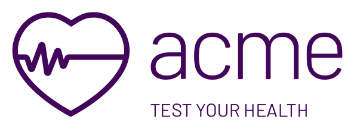

# Acme Sample App

Acme is a fictitious health organization. The Acme sample sample app is used to showcase some of the DexCare's iOS/Swift SDK fuctionality.

## Releases

Starting with SDK 9.2.0, we are slowly reshaping our sample app in SwiftUI. Each release of the SDK will have a version that works with that SDK.

## How to install/run

Once you downloaded this repository, you just need to update the `DexConfig` file with the values provided by your DexCare representative and run the app.  

#### DexConfig file

The `.DexConfig` files contains an array of configurations. This was done so that you could switch between environments (dev/staging/prod) without having to rebuild the app. 

Here is more information on the SDK Configurations: https://developers.dexcarehealth.com/mobilesdk/initialization

## Problems

If you are encountering any issues, please create an issue, and we will get back to you as soon as we can.

## Changelog

Latest changes can be found in the [Changelog](changelog.md)

## Attributions

* **Lato Font**: The Sample App uses the [Lato Font](https://fonts.google.com/specimen/Lato) font. [Here](https://scripts.sil.org/cms/scripts/page.php?site_id=nrsi&id=OFL) is the Open Font license page.
